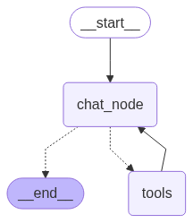

# LangGraph Agent for GAIA Questions

Creates an agent that can answer GAIA LLM Assistant evaluation. This project was created to complete the training certification process of Hugging Face's Agents course. The course asked participants to answer 20 Level 1 questions with a score of 30%.

More about GAIA - https://huggingface.co/papers/2311.12983

Hugging Faces Agents Course - https://huggingface.co/learn/agents-course/unit0/introduction

## Development Environment

|               |                        |
| ------------- | ---------------------- |
| Platform      | OS MacOS Sonoma 14.7.4 |
| IDE           | VS Code 1.100.2        |
| Runtime       | Python 3.13.1          |
| Documentation | Markdown / DocString   |
| Unit Testing  | PyTest                 |
| Repository    | GitHub.com             |

### Setup

1. Clone the GitHub repository

2. Create a virtual Python Environment.
   <br>NOTE: The .venv folder is listed in the .gitignore file.

```shell
python3 -m venv .venv
source .venv/bin/activate
pip install -r requirements.txt
```

3. Create a .env.development.local file. See the file template.env.development.local for required variables.
   <br>NOTE: The .env.development.local file is listed in the .gitignore file.

4. Converting audio files into transcripts is done using openai-whisper. Run following command to give the python environment SSL access to download the models.

```shell
/Applications/Python\ 3.13/Install\ Certificates.command
```

### Testing

Automated unit testing is performed by PyTest and testing activities were managed by VS Code's built in tools. More information about how to setup VS Code for PyTest can be found here - https://code.visualstudio.com/docs/python/testing

## Agent Design

The GAIA questions are answered by a LangGraph agent which uses OpenAI GPT 4.1 model and a collection of custom tools. The GPT 4.1 model is trained to return responses that contain instructions for the agent to invoke an available tool. The agent may use the small tool or a sequence of tool repeatidly until the model has determined that the question has been answered.

**Agent Diagram**



### Tools

- **audio_transcription_from_url** - Takes a URL to an audio file, downloads the file, and returns a transcription for LLM to use to answer questions.

- **dataframe_from_url** - Takes a URL to an XLSX file, downloads the file, and returns a pandas dataframe string for LLM processing.

- **image_data_from_url** - Takes a URL to an image file, download the file, and returns the data for LLM processing."

- **execute_python_code_from_url** - Takes a URL to a python file, downloads the file, then executes the code.

- **series_sum_from_json** - Takes a JSON string of number values compatible with a Pandas Series, and returns the sum of the string.

- **web_search_tool** - Use this to preform a web search for addition information needed to answer a question.

- **wikipedia_page_loader** - "Use this tool to retreive content from a Wikipedia page to use for addition context needed to answer a question.

- **youtube_transcription_from_url** - Takes a URL to a YouTube, downloads the audio only file, and returns a transcription for LLM to use to answer questions. The the video transcript could be a narration describing what is happening on camera.
